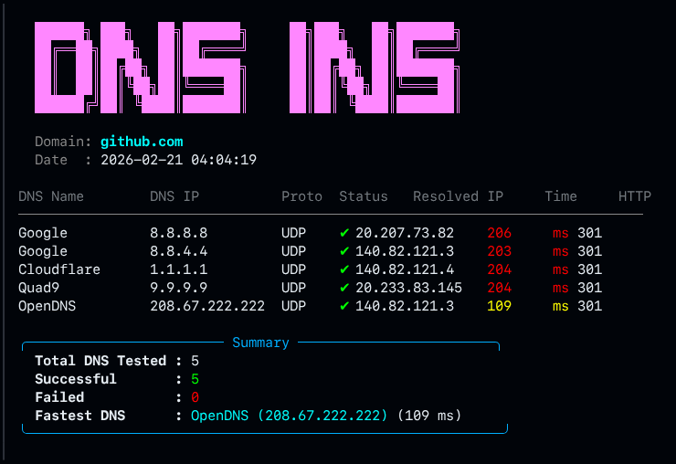

```
                          ██████╗ ███╗   ██╗███████╗     ██╗███╗   ██╗███████╗
                          ██╔══██╗████╗  ██║██╔════╝     ██║████╗  ██║██╔════╝
                          ██║  ██║██╔██╗ ██║███████╗     ██║██╔██╗ ██║███████╗
                          ██║  ██║██║╚██╗██║╚════██║     ██║██║╚██╗██║╚════██║
                          ██████╔╝██║ ╚████║███████║     ██║██║ ╚████║███████║
```
## 🚀 Modern DNS Inspector  
**Minimal. Fast. Clean. No nonsense.**

If you don’t need flashy dashboards and just want a **simple, elegant, and fast DNS tester** that tells you which DNS is actually performing best — this is it.




---

### ✨ Why You’ll Love It

- ✅ Tests top public DNS providers (Google, Cloudflare, Quad9, OpenDNS, AdGuard)  
- ✅ Real DNS resolution using `dig`  
- ✅ HTTP check against resolved IP  
- ✅ Clean spinner animation while testing  
- ✅ Color‑coded response times  
- ✅ Clear summary with fastest DNS  
- ✅ Lightweight and dependency-minimal  

No clutter. No overengineering. Just results.

---

### 📦 Requirements

- `dig`
- `curl`

Install on Ubuntu/Debian:

```bash
sudo apt install dnsutils curl
```

---

### ⚡ Usage

```bash
# Default test (github.com)
./dns_ins.sh

# Test a custom domain
./dns_ins.sh google.com
./dns_ins.sh discord.com

# Use a custom DNS list file (format: IP|Name)
./dns_ins.sh example.com mydns.txt
```

---

### 🖥 Example Output

```
Domain: github.com
Date  : 2026-02-21 22:15:03

DNS Name        DNS IP          Proto  Status   Resolved IP     Time     HTTP
────────────────────────────────────────────────────────────────────────────
Google          8.8.8.8         UDP    ✔        140.82.121.3    28ms     301
Cloudflare      1.1.1.1         UDP    ✔        140.82.121.4    19ms     301
Quad9           9.9.9.9         UDP    ✔        140.82.121.4    35ms     301
OpenDNS         208.67.222.222  UDP    ✔        140.82.121.4    87ms     301
AdGuard         94.140.14.14    UDP    ✔        140.82.121.4    112ms    301

╭──────────────────────── Summary ────────────────────────╮
  Total DNS Tested : 5
  Successful       : 5
  Failed           : 0
  Fastest DNS      : Cloudflare (1.1.1.1) (19 ms)
╰──────────────────────────────────────────────────────────╯
```

---

### 🔥 When Should You Use It?

- Internet feels slow and you suspect DNS
- You want to switch to the fastest resolver
- You're testing VPS/network performance
- You just love clean terminal tools

Run it. Get instant clarity. Switch to the fastest DNS.

```bash
./dns_ins.sh github.com
```

**Simple tools. Real answers.**