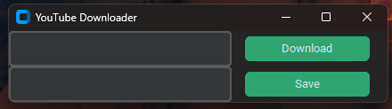

# ${\tt  Welcome\ \tt to \ \tt My \ \to {\color{red}TOOLS} \ \leftarrow \tt Repo}$

I specialize in creating practical and user-friendly software with beautiful graphical interfaces, using the power of Python. Every project I develop is designed with real-world challenges in mind, aiming to make your daily tasks easier, faster, and more efficient. My goal is to turn complex problems into simple, elegant solutions that anyone can use and benefit from. I hope the tools I build can add real value to your work and life.

## $\textcolor{orange}{ScreanShot}$

